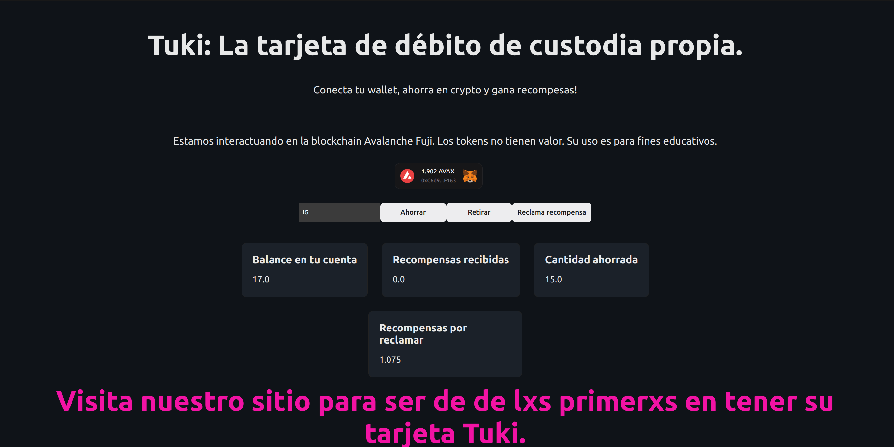

#  Tuki

     
    
     

## Dapp de staking en Avalanche Fuji.

### Relevant links

| What? | Link |
|---|---|
| Staking contract address | https://testnet.snowtrace.io/address/0x81dB4c796781489f9Eed63C2965156b0533Ab5e2 |
| Staking Token contract address | https://testnet.snowtrace.io/address/0x86BA6D1F23268262c5C33e02B3eA1C0299f7288a |
| Reward Token contract address | https://testnet.snowtrace.io/address/0x0349dc9A9D2Da6A6F6b02AE6A3AFaD45C21f19E8 |
| Demo en Avalanche Fuji | https://avalanchestaking.vercel.app/ |
| Mint ERC20 Demo | https://avalanche-token-drop.vercel.app/ |
| Landing | https://tukicard.xyz |

### Tech stack
1. Next.js
2. Thirdweb.js
3. Ethers.js

### ¿Cómo funciona?
Creamos una dapp para enseñar cómo funciona que un usuario autorice el gasto de algún token por parte de un contrato inteligente.
En este caso, el usuario puede ahorrar en un token ERC-20 y recibir recompensas por sus ahorros en otro token ERC-20.

Mintea gratis ERC20 en el siguiente link https://avalanche-token-drop.vercel.app/ para interactuar con nuestra demo

     
    
     

